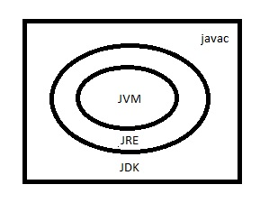

## Overview of The Course

This is some topics are divided into several points, will be gonna discussed in this training, those are:

- Loop, Function, Variable,
- OOP
- Adv. Java
- Spring
- Spring Book

### Resource

Some resources to learn Java:

- [Java Tutorial - Javatpoint](https://www.javatpoint.com/java-tutorial)
- [Java Tutorial - Tutorials Point](https://www.tutorialspoint.com/java/index.htm)
- Book: Complete Reference of Java by Herbert Shield

### Syntax and Semantics

Semantics = Valid Syntax

### Hiererchical View of JDK, JRE, JVM



### Basic Syntax of Java

```
public class <Class Name> {
    public static void main(String[] args) {
        /* Some code to execute. */
    }
}
```

### Reserved Words in Java

There are about 54 reserved words in Java. [Click here](https://www.w3schools.com/java/java_ref_keywords.asp) for details.
